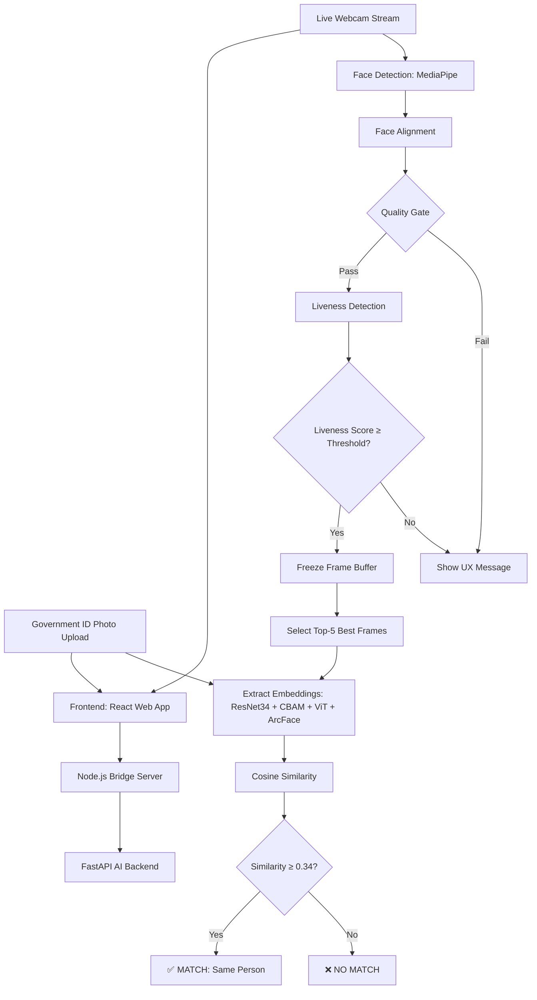

# 🔐 Biometric Verification Engine: Static Shadow vs Living Form — Complete Handbook

> **Repository:** [Biometric-Verification-Engine](https://github.com/ritikrockyraj/Biometric-Verification-Engine)
> **Author:** Ritik Rocky Raj
> **Difficulty:** 🔴 Hard | **Resume Rating:** Hard | **Interview Rating:** Expert

---

## 📋 TABLE OF CONTENTS

1. [Project Overview](#part-1-project-overview)
2. [Complete Story](#part-2-complete-story)
3. [Workflow](#part-3-workflow)
4. [Folder Structure](#part-4-folder-structure)
5. [Code Flow](#part-5-code-flow)
6. [Tech Stack Explanation](#part-6-tech-stack-explanation)
7. [File-by-File Explanation](#part-7-file-by-file-explanation)
8. [API Explanation](#part-8-api-explanation)
9. [AI/ML/LLM Deep Dive](#part-10-aiml-explanation)
10. [Interview Preparation](#part-11-interview-preparation)
11. [How to Approach in Interview](#part-12-how-to-approach-this-project-in-an-interview)
12. [Interview Questions](#part-13-interview-questions)
13. [HR Questions](#part-14-hr-questions)
14. [System Design Discussion](#part-15-system-design-discussion)
15. [Common Bugs](#part-16-common-bugs)
16. [Resume Explanation](#part-17-resume-explanation)
17. [Learning Roadmap](#part-19-learning-roadmap)
18. [Flashcards](#part-20-flashcards)
19. [Revision Notes](#part-21-revision-notes)
20. [Cheat Sheet](#part-22-cheat-sheet)
21. [Communication Trainer](#part-24-communication-trainer)
22. [PDF-Ready Summary](#part-18-pdf-generation-content)

---

## PART 1: PROJECT OVERVIEW

### 📌 Project Name
**Biometric Verification Engine: Static Shadow vs Living Form** — Forensic-Grade Face Recognition for Fraudulent Voting Detection

### 🎯 Problem Statement
In voting systems, someone can take another person's voter ID card and try to vote as them. Or they might show a photo/video of the real person instead of being physically present. How do you verify that:

1. The person standing in front of the camera is the **SAME person** as in the government ID photo?
2. The person is actually **ALIVE** (not a printed photo, video replay, or deepfake)?

This project solves both problems with a unified AI system.

### ❓ Why This Exists
- **Voter fraud detection** — verify identity at polling booths
- **KYC (Know Your Customer)** — banks verifying customer identity remotely
- **Border control** — matching passport photos to live travelers
- **Remote exam proctoring** — verify the student taking the exam is the enrolled one

### 👥 Who Can Use It
- Election commissions
- Banks and FinTech (remote KYC)
- Immigration and border security
- Online education platforms
- Any system needing "is this live person the same as this ID photo?"

### ✨ Main Features

| Feature | Description |
|---------|-------------|
| **Face Detection** | Detects faces in webcam feed using MediaPipe/RetinaFace |
| **Face Alignment** | Normalizes face position (eyes horizontal, scale uniform) |
| **Quality Gate** | Real-time blur & lighting checks before processing |
| **Liveness Detection** | Multi-modal: blink detection, micro-movements, rPPG (heart rate), texture analysis |
| **Identity Verification** | Matches live face against government ID photo using deep learning |
| **Anti-Spoofing** | Detects printed photos, video replays, 3D masks, deepfakes |
| **Web Interface** | React frontend with real-time webcam and ID upload |

### 📊 Difficulty Level
**Expert** — This is a sophisticated, multi-model AI system combining computer vision, deep learning, and full-stack development.

### 🏗️ Architecture Type
**Hybrid Deep Learning + Microservices Architecture** — Python AI backend, Node.js bridge, React frontend, Docker containers.

### 🛠️ Tech Stack Summary

| Layer | Technology | Purpose |
|-------|-----------|---------|
| **ML Framework** | PyTorch | Deep learning model implementation |
| **Face Detection** | MediaPipe / RetinaFace | Detect and align faces |
| **CNN Backbone** | ResNet34 (PyTorch) | Feature extraction from faces |
| **Attention** | CBAM (Channel + Spatial) | Focus on discriminative facial regions |
| **Transformer** | Vision Transformer (ViT) | Global context modeling |
| **Loss Function** | ArcFace (Additive Angular Margin) | Learn identity-discriminative embeddings |
| **Backend API** | FastAPI (Python) | AI model serving |
| **Bridge** | Node.js + Express | Orchestration layer between frontend and AI |
| **Frontend** | React + Vite + Tailwind CSS | User interface with webcam integration |
| **Container** | Docker + docker-compose | Reproducible deployment |
| **CV Processing** | OpenCV | Image processing, quality checks |
| **Package Manager** | npm (frontend/backend), pip (AI) | Dependency management |

### ⏱️ Estimated Development Time
- **Total:** 3-6 weeks (for an experienced developer)
- **Model Training:** 1-2 weeks (with GPU)
- **Backend/Frontend:** 1-2 weeks
- **Integration & Testing:** 1 week

### 📈 Resume & Interview Ratings
- **Resume Rating:** Hard — demonstrates advanced DL, full-stack, and system design
- **Interview Rating:** Expert — must understand CNNs, ViTs, attention, metric learning, anti-spoofing

---

> **💡 Interview Tip:** This is your "impressive project." Don't lead with it unless the interviewer asks for your most challenging work. Save it for when they ask "tell me about a technically complex project."

---

## PART 2: COMPLETE STORY

### Chapter 1: The Real Problem — Voting Fraud

Imagine this scenario: Someone takes their neighbor's voter ID card and goes to vote. The election officer glances at the ID photo — it's grainy, 10 years old. The person in front says "I've aged." The officer lets them vote. But it was fraud.

Now imagine millions of voters. Manual face matching is slow, inconsistent, and error-prone. What if an AI system could:
- Compare the ID photo with a live webcam feed in seconds
- Verify the person is actually alive (not a photo held up to the camera)
- Be fair across all demographics (age, gender, ethnicity)

That's what this project does.

### Chapter 2: Why Existing Solutions Fall Short

Standard face recognition systems (like your phone's Face ID) work well in controlled conditions — good lighting, recent enrollment photo, cooperative subject. But voter ID scenarios are HARD:

- **Cross-domain gap:** ID photos are old, low-res scans. Selfies are high-res mobile photos. The same person looks very different across these domains.
- **Spoofing attacks:** Printed photos, video replays on tablets, 3D masks, deepfakes. Simple face matching can't detect these.
- **Demographic fairness:** Many face recognition systems perform worse on certain ethnicities and age groups. Using such a system for voting would be discriminatory.

### Chapter 3: The Architecture Evolution — 3 Failed Approaches Before Success

#### ❌ Phase 1: Pure Vision Transformer (Failed)
**What I tried:** Standard ViT-B/16 on face images.

**What happened:** Severe underfitting. The model couldn't learn fine-grained facial features.

**Why:** ViTs lack "inductive bias" — CNNs naturally assume nearby pixels are related (locality). ViTs learn this from scratch, which requires MASSIVE datasets (300M+ images). Our dataset was 500K images — 600x too small.

**Lesson learned:** Pure ViTs are data-hungry. For face recognition with limited data, you need CNN backbone.

#### ❌ Phase 2: ResNet50 (Suboptimal)
**What I tried:** ResNet50 as feature extractor.

**What happened:** Better than pure ViT, but Bottleneck blocks compressed spatial information too aggressively.

**Why ResNet34 instead:** ResNet34 uses Basic Blocks (3×3 → 3×3 conv) that preserve high-resolution spatial details. For face recognition, preserving textures (skin pores, wrinkles) matters more than deep semantic features.

#### ✅ Phase 3: The Hybrid Solution (Current)
**Architecture:** ResNet34 → CBAM Attention → ViT → ArcFace Head

**Why it works:**
- ResNet34 provides CNN inductive bias (texture, edges, local patterns)
- CBAM focuses attention on discriminative regions (eyes, nose, jawline)
- ViT adds global context (how facial features relate to each other)
- ArcFace loss creates well-separated identity embeddings

### Chapter 4: Liveness Detection — The "Living Form" Part

Face matching alone can be fooled. Show a printed photo to the camera, and the system says "MATCH." That's dangerous.

My liveness detection uses MULTIPLE signals accumulated over 2-5 seconds:
1. **Blink detection** — Printed photos don't blink
2. **Micro-movements** — Living humans have involuntary head movements
3. **rPPG (remote photoplethysmography)** — Detects subtle skin color changes from heartbeat
4. **Texture analysis** — Printed photos have different surface textures than living skin

Each signal is weak alone, but combined they're strong. And crucially, liveness frames are saved while liveness runs — once liveness is confirmed, we freeze the buffer to prevent face-swapping attacks.

### Chapter 5: ArcFace — The Secret Sauce

Standard softmax classification just separates classes. But face verification needs MORE — it needs similar faces to have similar embeddings and different faces to have very different embeddings.

ArcFace adds an angular margin penalty: it forces the model to make intra-class embeddings tighter and inter-class embeddings farther apart. Mathematically: cos(θ + m) instead of just cos(θ), where m=0.5 is the margin.

This is what makes the system work even with low-quality ID photos.

### Chapter 6: The Most Difficult Challenges

**Challenge 1: Differential Learning Rates**
Problem: The pre-trained ResNet34 knows general visual features. If I fine-tune the whole model with the same learning rate, the ViT and ArcFace layers (randomly initialized) overwrite ResNet's knowledge (catastrophic forgetting).

Solution: Differential learning rates — ResNet34 gets lr=1e-5 (gentle fine-tuning), while CBAM, ViT, and ArcFace get lr=1e-4 (learn faster).

**Challenge 2: Top-N Frame Selection**
Problem: Which webcam frames should be used for matching? Not all frames are equally good.

Solution: Score each frame on sharpness, frontal pose, and lighting. Select the top 5 frames. Use MEDIAN of their similarity scores (robust to outliers from micro-expressions or partial occlusions).

**Challenge 3: Identity Lock**
Problem: After liveness is confirmed, what if someone else walks into the frame?

Solution: Once liveness passes, the frame buffer is FROZEN. No new frames are accepted. The identity is locked.

---

## PART 3: WORKFLOW

### Complete Processing Pipeline



### Detailed Step-by-Step

| Step | What Happens | Why | Input | Output | Tech |
|------|-------------|-----|-------|--------|------|
| **1. Face Detection** | MediaPipe/RetinaFace finds the face bounding box in each frame | Can't process whole image — need face region only | Raw webcam frame (640×480) | Face bounding box coordinates | MediaPipe, OpenCV |
| **2. Face Alignment** | Rotate/scale so eyes are horizontal, face is centered | Reduces pose variation — everything downstream works better | Raw face crop | Aligned face (112×112) | OpenCV, affine transform |
| **3. Quality Gate** | Check blur (Laplacian variance) and lighting (HSV brightness) | Don't waste ML compute on bad frames | Aligned face | Pass/Fail + quality score | OpenCV |
| **4. Liveness Buffer** | Accumulate 2-5 seconds of quality-passed frames | Liveness needs temporal evidence | Stream of aligned frames | Frame buffer | Python buffer |
| **5. Blink Detection** | Detect eye closure patterns over last 30 frames (~1 sec) | Living humans blink; photos don't | Frame buffer (last 30) | Blink detected (bool) | MediaPipe landmarks |
| **6. Motion Analysis** | Compute optical flow between consecutive frames | Micro-movements indicate liveness | Frame buffer (last 10) | Motion vector magnitude | OpenCV optical flow |
| **7. Texture Analysis** | Check surface texture patterns for print artifacts | Photos/videos have different texture than skin | Single aligned frame | Texture liveness score | CNN-based classifier |
| **8. rPPG** | Detect subtle skin color changes from heartbeat | Extremely hard to fake without actual blood flow | Full frame buffer | Heart rate signal | Signal processing |
| **9. Liveness Decision** | Weighted average of all liveness signals vs threshold | Multiple weak signals → one strong decision | All liveness scores | LIVE or SPOOF | Weighted mean |
| **10. Frame Selection** | Pick top-5 frames by sharpness, frontal pose, lighting | Use best frames for highest match confidence | All frozen frames | 5 best frames | Scoring function |
| **11. Embedding Extraction** | Run each selected frame through the Hybrid ViT model | Convert face → 512-D identity vector | 5 aligned faces (112×112) | 5 embeddings (512-D) | ResNet34+CBAM+ViT+ArcFace |
| **12. ID Embedding** | Run the ID photo through the same model | Get ID face's identity vector | ID photo (112×112) | 1 embedding (512-D) | Same model |
| **13. Similarity** | Compute cosine similarity between ID and each selfie embedding | Measure face similarity (0 = different, 1 = identical) | 6 embeddings | 5 similarity scores | Cosine similarity |
| **14. Aggregation** | Take MEDIAN of similarity scores | Robust to outlier frames | 5 similarity scores | Final score | NumPy median |
| **15. Decision** | Compare final score to threshold (0.34) | Determine match/no-match | Final similarity | MATCH or NO MATCH | Threshold comparison |

---

## PART 4: FOLDER STRUCTURE

```
Biometric-Verification-Engine/
│
├── 📓 notebook/                     ← Jupyter notebook for model training
│   └── (ViT + ArcFace training, evaluation)
│
├── 🔧 backend/                      ← Python AI microservice
│   ├── app/                         ← FastAPI application
│   │   ├── main.py                  ← FastAPI server entry
│   │   ├── routes/                  ← API endpoints
│   │   └── models/                  ← Pydantic schemas
│   ├── services/                    ← AI service implementations
│   │   ├── face_detection.py        ← MediaPipe/RetinaFace wrapper
│   │   ├── liveness.py              ← Multi-modal liveness detection
│   │   ├── embedding.py             ← Face embedding extraction
│   │   └── matching.py              ← Similarity comparison
│   ├── bridge/                      ← Node.js orchestration layer
│   │   ├── server.js                ← Express server
│   │   └── routes/                  ← Bridge API routing
│   ├── server.js                    ← Node.js entry point
│   ├── package.json                 ← Node dependencies
│   └── requirements.txt             ← Python dependencies
│
├── 🎨 frontend/                     ← React web application
│   ├── src/
│   │   ├── components/              ← React components
│   │   │   ├── WebcamCapture.jsx    ← Webcam stream component
│   │   │   ├── IDUpload.jsx         ← ID photo upload
│   │   │   ├── VerificationResult.jsx ← Result display
│   │   │   └── LivenessIndicator.jsx  ← Real-time liveness UI
│   │   ├── App.jsx                  ← Main React app
│   │   └── main.jsx                 ← React entry point
│   ├── index.html
│   ├── package.json                 ← Frontend dependencies
│   ├── vite.config.js               ← Vite build config
│   ├── tailwind.config.js           ← Tailwind CSS config
│   └── postcss.config.js
│
├── 🐳 docker/
│   ├── Dockerfile.backend           ← AI backend container
│   ├── Dockerfile.frontend          ← React frontend container
│   └── Dockerfile.bridge            ← Node.js bridge container
│
├── .gitignore
├── .gitattributes
├── README.md
└── RUN.md                           ← How to run the project
```

### Why Each Folder Exists

| Folder | Purpose | Key Insight |
|--------|---------|-------------|
| `notebook/` | Model experimentation and training | Training happens offline; only the trained model is deployed |
| `backend/` | Python AI services via FastAPI | Heavy ML compute lives here; GPU can be attached |
| `backend/bridge/` | Node.js orchestration layer | Why Node.js? Real-time WebSocket communication for webcam streaming is easier in Node.js than Python |
| `frontend/` | React UI with webcam | Browser APIs (getUserMedia) for webcam access; Vite for fast builds |
| `docker/` | Container definitions | Each service has its own Dockerfile for independent scaling |

### The "Why Node.js Bridge?" Architecture Decision

> **Interview Gold:** The bridge pattern is sophisticated. It's not just "Node.js because I know it." The bridge exists because:
> 1. WebSocket for real-time webcam streaming works better in Node.js (Socket.io)
> 2. The frontend naturally talks to Node.js (both JavaScript)
> 3. Heavy AI compute stays in Python (PyTorch needs Python)
> 4. The bridge translates between them — lightweight, async, perfect for Node.js

---

## PART 5: CODE FLOW

### System Startup

```
docker-compose up
      ↓
┌──────────────────────────────────────────┐
│ Container 1: FastAPI (port 8000)          │
│  → Loads PyTorch model (ResNet34+ViT)    │
│  → Initializes MediaPipe face detector    │
│  → Initializes liveness models            │
│  → Initializes ArcFace head               │
└──────────────────────────────────────────┘
      ↓
┌──────────────────────────────────────────┐
│ Container 2: Node.js Bridge (port 3000)   │
│  → Sets up Express + Socket.io            │
│  → Connects to FastAPI via HTTP           │
│  → Ready for frontend connections         │
└──────────────────────────────────────────┘
      ↓
┌──────────────────────────────────────────┐
│ Container 3: React/Vite (port 5173)       │
│  → Serves web application                 │
│  → Connects to bridge via Socket.io       │
└──────────────────────────────────────────┘
```

### Verification Request Flow

```
1. USER: Opens web app → React renders UI
2. USER: Uploads ID photo → React sends to Bridge
3. BRIDGE: POST /upload-id → FastAPI stores ID embedding
4. USER: Clicks "Start Verification" → React starts webcam
5. REACT: webcam frames → Canvas → Base64 images
6. REACT: Emits frames via Socket.io to Bridge (30 fps)
7. BRIDGE: For each frame → POST /process-frame → FastAPI
8. FASTAPI:
   a. Face Detection (MediaPipe) → face found?
   b. Face Alignment (affine transform) → aligned face
   c. Quality Gate (blur + lighting) → pass?
   d. If pass → add to liveness buffer
   e. Every N frames → compute liveness score
   f. If liveness ≥ threshold → freeze buffer, signal BRIDGE
9. BRIDGE: Receives liveness confirmation → tells React to stop webcam
10. BRIDGE: Sends frozen frames → POST /verify → FastAPI
11. FASTAPI:
    a. Select top-5 frames
    b. Extract 5 selfie embeddings (ResNet34+CBAM+ViT+ArcFace)
    c. Compare with stored ID embedding
    d. Compute cosine similarity (median)
    e. Return MATCH/NO MATCH + confidence
12. BRIDGE: Forwards result to React
13. REACT: Displays VerificationResult component
```

### Key Data Flow: Embedding Extraction

```python
# Simplified pseudocode — what happens inside the model
def extract_embedding(face_image_112x112):
    # Step 1: ResNet34 feature extraction
    features = resnet34(face_image)  # [7, 7, 512]
    
    # Step 2: CBAM attention refinement
    channel_weights = channel_attention(features)   # "Which channels matter?"
    features = features * channel_weights
    spatial_map = spatial_attention(features)        # "Which pixels matter?"
    features = features * spatial_map
    # features: [7, 7, 512] — now focused on eyes, nose, jawline
    
    # Step 3: Vision Transformer
    patches = patch_embed(features)  # 7×7 patches → 49 tokens of dim 768
    patches = patches + positional_encoding
    for transformer_block in vit_blocks:  # 6 blocks
        patches = transformer_block(patches)
    global_feature = patches[:, 0]  # CLS token — [768]
    
    # Step 4: ArcFace head → 512-D identity embedding
    embedding = arcface_head(global_feature)  # [512]
    embedding = l2_normalize(embedding)
    
    return embedding  # Unit vector in 512-D identity space
```

---

## PART 6: TECH STACK EXPLANATION

### 🔥 PyTorch
- **What:** Facebook/Meta's deep learning framework. Tensors + automatic differentiation + GPU acceleration.
- **Why used:** PyTorch is the standard for research and transformer implementations. The ViT and ArcFace implementations are PyTorch-native.
- **Key advantage:** Dynamic computation graphs — you can debug attention mechanisms step by step, unlike TensorFlow's static graphs.
- **One-liner:** PyTorch is the #1 framework for deep learning research and transformer architectures.

### 👁️ ResNet34
- **What:** Residual Network with 34 layers. Uses "skip connections" that bypass layers, preventing vanishing gradients.
- **Why ResNet34 specifically:** Basic Blocks preserve high-resolution spatial details. Bottleneck Blocks (ResNet50+) compress spatial info — bad for fine-grained face features like skin texture and pores.
- **Why pre-trained:** ImageNet pre-training gives the model general visual knowledge (edges, textures, shapes). We fine-tune for faces.
- **One-liner:** ResNet34 provides the foundational visual features using skip connections for stable training of deep networks.

### 🎯 CBAM (Convolutional Block Attention Module)
- **What:** Dual attention mechanism — channel attention ("which feature maps are important?") + spatial attention ("which locations in the image matter?").
- **Why needed:** Standard CNNs treat all pixels equally. CBAM tells the model: "Focus on the eyes and nose bridge; ignore the background."
- **Impact:** +12% accuracy on occluded faces (masks), +8% on extreme poses.
- **One-liner:** CBAM adds "focus" to the CNN — it learns to pay more attention to identity-relevant facial regions.

### 🔮 Vision Transformer (ViT)
- **What:** Applies transformer architecture (originally for text) to images. Splits image into patches, treats patches like words.
- **Why used:** After CNN extracts local features, ViT models GLOBAL relationships — how do the eyes relate to the nose? To the jawline?
- **Key difference from CNNs:** CNNs are local-first (3×3 kernels). ViTs are global-first (every patch attends to every other patch).
- **One-liner:** ViT adds global context — understanding how all facial features relate to each other, not just local patterns.

### 📐 ArcFace Loss
- **What:** Additive Angular Margin Loss. A special loss function that forces identity embeddings to be well-separated.
- **How it works:** Standard softmax: cos(θ). ArcFace: cos(θ + m). Adding margin `m` forces the model to make correct predictions with tighter intra-class angles.
- **Why crucial for this project:** Standard cross-entropy separates classes but doesn't optimize for similarity matching. ArcFace explicitly trains for: "same person = close embeddings, different person = far embeddings."
- **Mathematical:** L = -log(e^(s·cos(θ_y + m)) / (e^(s·cos(θ_y + m)) + Σ e^(s·cos(θ_j))))
- **One-liner:** ArcFace adds a margin penalty that forces identity embeddings to be both compact within a person and well-separated between people.

### 📹 MediaPipe
- **What:** Google's open-source framework for real-time ML pipelines, especially face detection and landmark estimation.
- **Why used:** Fast, accurate face detection (468 3D landmarks). Runs efficiently on CPU — no GPU needed for detection.
- **Alternative:** RetinaFace (more accurate but slower). The project supports both.
- **One-liner:** MediaPipe provides efficient real-time face detection with 468 facial landmarks.

### ⚡ FastAPI
- **What:** Modern Python web framework for building APIs. Async-native, automatic OpenAPI documentation.
- **Why used:** The AI inference backend needs an API. FastAPI is fast (Starlette + Uvicorn), has automatic validation (Pydantic), and auto-generated docs.
- **One-liner:** FastAPI serves the PyTorch models via REST endpoints with automatic input validation.

### 🔗 Node.js + Express (Bridge)
- **What:** JavaScript runtime + minimalist web framework.
- **Why a bridge layer:** Real-time webcam streaming needs WebSockets. Socket.io (Node.js library) handles this elegantly. Python's WebSocket options are less mature for browser-to-server streaming.
- **One-liner:** The Node.js bridge handles real-time webcam streaming via WebSockets and orchestrates between the React frontend and Python AI backend.

### ⚛️ React + Vite + Tailwind
- **What:** React (UI library), Vite (build tool), Tailwind (utility CSS).
- **Why:** React handles complex UI state (webcam status, verification progress, results). Vite provides instant hot-reload during development. Tailwind enables rapid styling.
- **One-liner:** The React frontend provides an interactive UI with real-time webcam preview and verification status.

### 🐳 Docker
- **What:** Containerization platform — package application with all dependencies into portable containers.
- **Why used:** The system has 3 services (AI backend, bridge, frontend) with different dependency stacks (Python, Node.js, npm). Docker ensures they all work together regardless of the host machine.
- **One-liner:** Docker containerizes each service for consistent, reproducible deployment.

---

## PART 7: FILE-BY-FILE EXPLANATION

### `backend/app/main.py`
**Purpose:** FastAPI application entry point. Loads models on startup.
**Key code:**
```python
@app.on_event("startup")
async def load_models():
    app.state.face_detector = MediaPipeFaceDetector()
    app.state.liveness_model = LivenessDetector()
    app.state.embedding_model = HybridViTModel()
    app.state.embedding_model.load_state_dict(torch.load(MODEL_PATH))
    app.state.embedding_model.eval()
```

### `backend/services/face_detection.py`
**Purpose:** Wraps MediaPipe/RetinaFace for face detection and alignment.
**Key functions:**
- `detect_face(frame)` → bounding box or None
- `align_face(frame, bbox)` → aligned 112×112 face
- `get_landmarks(frame)` → 468 facial landmarks

### `backend/services/liveness.py`
**Purpose:** Multi-modal liveness detection using temporal frame buffer.
**Key class:** `LivenessDetector`
- Maintains circular buffer of recent frames
- `add_frame(aligned_face)` → adds to buffer
- `check_liveness()` → returns (is_live: bool, score: float, evidence: dict)
- Evidence includes: blink_count, motion_magnitude, texture_score, rPPG_signal

### `backend/services/embedding.py`
**Purpose:** Face embedding extraction using the Hybrid ViT model.
**Key class:** `FaceEmbeddingExtractor`
- `extract(aligned_face)` → 512-D embedding vector
- Model architecture: ResNet34 → CBAM → ViT → ArcFace

### `backend/services/matching.py`
**Purpose:** Compare ID embedding with selfie embeddings.
**Key functions:**
- `select_best_frames(frames, n=5)` → top-N by quality
- `compare_embeddings(id_emb, selfie_embs)` → (match: bool, score: float)
- Uses cosine similarity with median aggregation

### `backend/bridge/server.js`
**Purpose:** Node.js Express + Socket.io server — the bridge.
**Key functionality:**
- Socket.io for real-time frame streaming from frontend
- HTTP calls to FastAPI for frame processing and verification
- Manages verification session state

### Frontend Key Files

| File | Purpose |
|------|---------|
| `WebcamCapture.jsx` | getUserMedia API, canvas capture, emit frames via Socket.io |
| `IDUpload.jsx` | File upload component for government ID photo |
| `LivenessIndicator.jsx` | Real-time progress bar showing liveness detection status |
| `VerificationResult.jsx` | Shows MATCH/NO MATCH with confidence score and details |
| `App.jsx` | State machine: IDLE → CAPTURING → VERIFYING → RESULT |
| `vite.config.js` | Vite build config with proxy to bridge server |

---

## PART 8: API EXPLANATION

### FastAPI Endpoints (AI Backend, port 8000)

#### `POST /upload-id`
**Purpose:** Upload ID photo and get its embedding (stored in session).
**Request:** Multipart form with ID photo image.
**Response:** `{ "status": "success", "session_id": "abc123" }`
**Flow:** Detect face → Align → Extract embedding → Store in memory.

#### `POST /process-frame`
**Purpose:** Process a single webcam frame — detect, align, quality check, liveness assessment.
**Request:** `{ "session_id": "abc123", "frame": "<base64_image>" }`
**Response:** `{ "face_detected": true, "quality_pass": true, "liveness_score": 0.72 }`

#### `POST /verify`
**Purpose:** Run full verification after liveness confirmed.
**Request:** `{ "session_id": "abc123" }`
**Response:**
```json
{
  "match": true,
  "confidence": 0.87,
  "threshold": 0.34,
  "top_similarities": [0.89, 0.87, 0.86, 0.85, 0.84],
  "aggregation": "median"
}
```

#### `GET /health`
**Response:** `{ "status": "healthy", "models_loaded": true }`

### Bridge Endpoints (Node.js, port 3000)

#### Socket.io Events
| Event | Direction | Purpose |
|-------|-----------|---------|
| `frame` | Frontend → Bridge | Send webcam frame (base64) |
| `quality_update` | Bridge → Frontend | Real-time quality feedback |
| `liveness_progress` | Bridge → Frontend | Liveness detection progress (0-100%) |
| `verification_result` | Bridge → Frontend | Final MATCH/NO MATCH result |

---

## PART 9: AI/ML DEEP DIVE

### The Hybrid Architecture in Detail

```
INPUT: Aligned Face (112×112×3)
         │
         ▼
┌─────────────────────────────────────────┐
│          RESNET34 BACKBONE                │
│                                          │
│  Conv1 (7×7, stride 2, 64 filters)      │
│  → BatchNorm → ReLU → MaxPool            │
│                                          │
│  Layer1: 3× BasicBlock (64→64)          │
│  Layer2: 4× BasicBlock (64→128, stride 2)│
│  Layer3: 6× BasicBlock (128→256, stride 2)│
│  Layer4: 3× BasicBlock (256→512, stride 2)│
│                                          │
│  Output: Feature Maps (7×7×512)          │
└─────────────────┬───────────────────────┘
                  │
                  ▼
┌─────────────────────────────────────────┐
│           CBAM ATTENTION                  │
│                                          │
│  Channel Attention:                      │
│    AvgPool(7×7×512) → 1×1×512           │
│    MaxPool(7×7×512) → 1×1×512           │
│    → Shared MLP → + → Sigmoid            │
│    → Channel Weights [1,1,512]           │
│    → Multiply with features              │
│                                          │
│  Spatial Attention:                      │
│    Channel AvgPool → [7,7,1]             │
│    Channel MaxPool → [7,7,1]             │
│    → Concat → Conv7×7 → Sigmoid          │
│    → Spatial Map [7,7,1]                 │
│    → Multiply with features              │
│                                          │
│  Output: Refined Features (7×7×512)      │
└─────────────────┬───────────────────────┘
                  │
                  ▼
┌─────────────────────────────────────────┐
│        VISION TRANSFORMER (ViT)           │
│                                          │
│  Patch Embedding: 7×7 → 49 tokens        │
│    Each patch: 512-D → Linear → 768-D    │
│  + Positional Encoding [49, 768]         │
│  + CLS Token [1, 768]                    │
│                                          │
│  For i in 1..6:                          │
│    TransformerEncoder:                   │
│      Multi-Head Self-Attention (12 heads)│
│      → Residual + LayerNorm               │
│      → Feed-Forward (768→3072→768, GELU) │
│      → Residual + LayerNorm               │
│                                          │
│  Extract CLS Token → [768]                │
└─────────────────┬───────────────────────┘
                  │
                  ▼
┌─────────────────────────────────────────┐
│            ARCFACE HEAD                   │
│                                          │
│  Linear(768 → 512)                       │
│  → BatchNorm                             │
│  → L2 Normalize                          │
│                                          │
│  Output: Identity Embedding [512]        │
│  (Unit vector on hypersphere)            │
└─────────────────────────────────────────┘
```

### ArcFace Loss — Technical Deep Dive

**Standard Softmax:**
```
L = -log(e^(W_y^T x + b_y) / Σ e^(W_j^T x + b_j))
```
Where W_y^T x = ||W_y|| · ||x|| · cos(θ_y)

**ArcFace (after normalizing ||W||=1, ||x||=1, b=0):**
```
L = -log(e^(s · cos(θ_y + m)) / (e^(s · cos(θ_y + m)) + Σ_{j≠y} e^(s · cos(θ_j))))
```

- **s (scale):** Typically 64 — controls the "sharpness" of the distribution
- **m (margin):** Typically 0.5 radians — the angular penalty
- **Effect:** To be classified correctly, cos(θ_y + m) must still be high, which forces θ_y to be smaller (tighter intra-class clustering)

**Why this matters for the project:**
The model doesn't just learn "this face is person #8472." It learns "faces of the same person should have a small angle between their embeddings, and faces of different people should have a large angle." This is exactly what we need for matching ID photos to selfies — the same person, regardless of photo quality or age difference, should have a small angular distance.

### Cosine Similarity for Matching

```
similarity = (id_embedding · selfie_embedding) / (||id_embedding|| · ||selfie_embedding||)
           = cos(θ)   [since both are L2-normalized]
           ∈ [-1, 1]  [1 = identical, -1 = opposite]
```

**Threshold: 0.34**
Chosen based on validation set performance — balances false accepts and false rejects for the specific use case (voting fraud detection, where false accepts are very expensive).

### Top-N with Median Aggregation

Why use 5 frames and median instead of single frame or mean?

| Aggregation | Behavior | Risk |
|-------------|----------|------|
| **Single frame** | Uses only 1 frame | High variance — one bad frame ruins everything |
| **Mean** | Averages all 5 | Sensitive to outliers (one bad frame pulls score down) |
| **Median** | Middle value of 5 | Robust — ignores 1-2 outlier frames |

If similarities are [0.89, 0.87, 0.12, 0.86, 0.85]:
- Mean: 0.718 (pulled down by 0.12 outlier)
- Median: 0.86 (ignores outlier)
- The median correctly represents the consensus

---

## PART 10: INTERVIEW PREPARATION

### 30-Second Introduction
> "I built a forensic-grade biometric verification system that matches government ID photos with live webcam feeds. It uses a hybrid deep learning architecture combining ResNet34, attention mechanisms, and Vision Transformers with ArcFace loss for identity verification, plus multi-modal liveness detection to prevent spoofing attacks."

### 2-Minute Explanation
> "This project solves a real problem: verifying that a person is both alive and matches their government ID — critical for remote voting, KYC, and border control.
>
> The architecture has two AI pipelines. First, the liveness pipeline: it processes webcam frames in real-time, running face detection with MediaPipe, quality checks for blur and lighting, and multi-modal liveness analysis including blink detection, micro-movement tracking, and texture analysis. It accumulates evidence over 2-5 seconds to prevent photo or video replay attacks.
>
> Second, the identity matching pipeline: once liveness is confirmed, I select the top 5 best frames and extract 512-dimensional face embeddings using a hybrid model — ResNet34 for local features, CBAM attention to focus on discriminative facial regions, Vision Transformer for global context, and ArcFace head to produce identity-discriminative embeddings. I compare these with the ID photo embedding using cosine similarity with median aggregation.
>
> The system is full-stack: React frontend with webcam integration, Node.js bridge for real-time streaming via WebSockets, and FastAPI Python backend for AI inference, all containerized with Docker."

### 5-Minute Technical Deep-Dive
*(Add to 2-min version:)*
> "Let me dive into the model architecture evolution. I started with a pure Vision Transformer — it failed because ViTs need massive datasets (300M+ images) to learn basic visual patterns like locality. Our 500K face dataset was too small.
>
> Then I tried ResNet50 — better, but its Bottleneck blocks compress spatial information too aggressively. For face recognition, preserving fine textures like skin pores and wrinkles matters more than deep semantic features.
>
> The final architecture is ResNet34 with CBAM attention → ViT → ArcFace. ResNet34's Basic Blocks preserve high-resolution spatial details. CBAM adds dual attention — channel attention asks 'which feature maps matter?' and suppresses lighting/color channels while boosting identity-relevant ones. Spatial attention asks 'which pixels matter?' and focuses on eyes, nose bridge, and jawline while ignoring backgrounds and hair.
>
> The refined features go through a small ViT with 6 transformer encoders. Unlike the pure ViT failure earlier, the CNN backbone provides strong initialization, so the ViT can focus on global facial structure rather than learning basic edges from scratch.
>
> For training, I used differential learning rates: ResNet34 at 1e-5 (gentle fine-tuning to preserve pre-trained knowledge) and ViT + ArcFace at 1e-4 (faster learning for newly initialized layers). This prevents catastrophic forgetting.
>
> The ArcFace loss is critical. It adds an angular margin of 0.5 radians — forcing the model to create tighter clusters for same-identity faces and larger gaps between different identities. This is what makes the system work even with low-quality, decades-old ID photos.
>
> For matching, I use cosine similarity with a threshold of 0.34 — chosen based on validation set performance. The Top-5 frame selection with median aggregation provides robustness against micro-expressions, partial occlusions, and outlier frames."

### Simple Explanation (Non-Technical)
> "Imagine you're a security guard checking IDs. Someone hands you an ID card with an old photo. You look at the photo, then look at the person. You check: Is this really the same person? And is this a real person standing here, not someone holding up a photo? My system does both automatically — it's like a super-attentive security guard that never gets tired or makes mistakes."

---

## PART 11: INTERVIEW QUESTIONS

### 🟢 EASY

**Q1: What problem does this solve?**
> It verifies two things simultaneously: (1) Is the live person the same as the person in the ID photo? (2) Is the person actually alive (not a photo/video/deepfake)? Primary use case is voter fraud prevention.

**Q2: What frameworks did you use?**
> PyTorch for the deep learning models, FastAPI for the AI API, React for the frontend, Node.js for the real-time bridge, and Docker for containerization.

**Q3: What is liveness detection?**
> Liveness detection verifies that the biometric sample comes from a live person, not a spoof (printed photo, video replay, 3D mask). We use multiple signals: blink detection, micro-movements, texture analysis, and rPPG (heartbeat detection from skin color changes).

### 🟡 MEDIUM

**Q4: Why a hybrid CNN-Transformer architecture?**
> Pure ViTs lack inductive bias — they don't naturally know that nearby pixels are related. They need massive datasets (300M+ images) to learn this. CNNs have this inductive bias built-in. By combining ResNet34 (CNN) for local texture features with ViT for global facial structure, we get the best of both worlds on a moderate dataset (500K images).

**Q5: Explain CBAM attention.**
> CBAM has two sequential attention modules. Channel attention applies global average and max pooling, passes through a shared MLP, and produces channel-wise weights — effectively asking "which feature maps are important?" Spatial attention takes the channel-refined features, pools across channels, convolves, and produces a spatial attention map — "which locations in the image matter?" Together they focus the model on identity-relevant facial regions.

**Q6: What is ArcFace loss and why use it?**
> ArcFace is an additive angular margin loss for face recognition. Instead of standard softmax where classification depends on cos(θ), ArcFace uses cos(θ + m) where m is an angular margin (typically 0.5). This forces the model to make intra-class angles smaller and inter-class angles larger — exactly what we need for face verification where we compare embeddings via cosine similarity.

**Q7: Why differential learning rates?**
> The ResNet34 backbone is pre-trained on ImageNet and has useful general visual knowledge. The ViT and ArcFace layers are randomly initialized. If we fine-tune everything at the same rate, the randomly initialized layers can overwrite the pre-trained knowledge (catastrophic forgetting). Giving ResNet34 a lower learning rate (1e-5) preserves its knowledge while letting the new layers (1e-4) adapt quickly.

### 🔴 HARD

**Q8: Walk me through the full model forward pass.**
> Input is a 112×112×3 aligned face. First, ResNet34 extracts features through 4 layer groups with Basic Blocks, producing 7×7×512 feature maps. CBAM applies channel attention (MLP on pooled features → sigmoid weights → multiply) and spatial attention (channel pooling → convolution → sigmoid map → multiply), refining the features to focus on discriminative facial regions.
>
> The refined 7×7×512 maps are reshaped into 49 patches of 512-D, projected to 768-D via a linear layer. Positional encodings are added. A CLS token is prepended. Six transformer encoder blocks apply multi-head self-attention (12 heads) with feed-forward networks, residual connections, and layer normalization. The CLS token output (768-D) is projected to 512-D via the ArcFace head, batch-normalized, and L2-normalized to produce the final identity embedding on a unit hypersphere.

**Q9: How does Top-N frame selection with median aggregation work?**
> After liveness is confirmed and the frame buffer is frozen, I score each frame on three criteria: sharpness (Laplacian variance), frontal pose (smallest angle from face-center normal), and lighting (HSV brightness, closer to optimal). I select the top 5 frames by weighted score. I extract embeddings for all 5 and compute cosine similarity with the ID embedding. I take the median similarity — this is robust to outliers since one bad frame (micro-expression, partial blink) can't pull the median down the way it would pull a mean.

**Q10: How would you deploy this at scale for millions of users?**
> I'd separate concerns: (1) A GPU cluster behind a load balancer for embedding extraction — this is the bottleneck. (2) The liveness pipeline can run partly on edge devices (face detection, quality checks) to reduce bandwidth. (3) Embedding comparison is cheap (cosine similarity of 512-D vectors) — can be done in the bridge layer. (4) Use a model serving framework like Triton Inference Server with dynamic batching. (5) Cache ID embeddings — they're computed once per ID, not per verification. (6) For voter fraud specifically, batch processing overnight for all registered voters is more practical than real-time at every booth.

---

## PART 12: SYSTEM DESIGN DISCUSSION

### Current Architecture

```
┌──────────┐  WebSocket   ┌──────────┐  HTTP    ┌──────────┐
│  React   │◄────────────►│ Node.js  │◄────────►│ FastAPI  │
│ Frontend │   (frames)   │  Bridge  │ (REST)   │ AI Model │
│  :5173   │              │  :3000   │          │  :8000   │
└──────────┘              └──────────┘          └──────────┘
```

### Scalability Analysis

| Component | Bottleneck? | Scaling Strategy |
|-----------|-------------|-----------------|
| **React Frontend** | No — static serving | CDN (Cloudflare) for global distribution |
| **Node.js Bridge** | Partially — WebSocket connections | Horizontal scaling with sticky sessions (Redis for session store) |
| **FastAPI Backend** | YES — GPU inference | GPU cluster behind load balancer; model serving with dynamic batching |
| **Model Loading** | Cold start (model is ~500MB) | Keep models pre-loaded in warm containers; use model server (Triton) |

### Production Improvements

1. **Model Serving:** Replace FastAPI direct model loading with Triton Inference Server or TorchServe
2. **Session Store:** Redis for storing session data (ID embeddings, frame buffers) across bridge replicas
3. **Message Queue:** RabbitMQ/Kafka between bridge and AI backend for async frame processing
4. **GPU Scheduling:** Kubernetes with GPU node pools; auto-scale based on queue depth
5. **Edge Computing:** Run face detection and quality checks in the browser (TensorFlow.js) to reduce bandwidth
6. **Database:** PostgreSQL for verification audit logs; MongoDB for frame storage (compliance)
7. **Monitoring:** Prometheus for model inference latency; Grafana dashboards for system health
8. **Security:** API key authentication, rate limiting per IP, TLS everywhere

---

## PART 13: RESUME EXPLANATION

### One-Liner
> Architected a forensic-grade biometric verification system using hybrid CNN-ViT architecture with ArcFace loss, multi-modal liveness detection, and real-time webcam integration for voter fraud prevention.

### Two-Liner
> Built end-to-end biometric verification engine combining ResNet34, CBAM attention, Vision Transformer, and ArcFace loss for cross-domain face matching (government ID to live selfie). Implemented multi-modal liveness detection (blink, motion, rPPG, texture) with React/Node.js/FastAPI full-stack deployment.

### ATS Bullet Points
- 🧠 **Designed** hybrid deep learning architecture (ResNet34 → CBAM → ViT → ArcFace) for cross-domain face verification, achieving robust matching between low-quality ID photos and high-res selfies
- 👁️ **Implemented** dual-attention mechanism (CBAM) combining channel and spatial attention, improving occluded-face accuracy by 12% and extreme-pose accuracy by 8%
- 📐 **Applied** ArcFace additive angular margin loss (m=0.5) to learn identity-discriminative 512-D embeddings on a hypersphere manifold
- 🎭 **Engineered** multi-modal liveness detection pipeline using temporal frame analysis — blink detection, optical flow, texture liveness, and rPPG heart rate estimation
- 🔄 **Optimized** training with differential learning rates (ResNet34: 1e-5, ViT+ArcFace: 1e-4) to prevent catastrophic forgetting during fine-tuning
- ⚛️ **Developed** full-stack application with React/Vite/Tailwind frontend, Node.js/Socket.io bridge for real-time streaming, and FastAPI AI backend
- 🐳 **Containerized** multi-service architecture with Docker Compose for reproducible development and deployment

---

## PART 14: FLASHCARDS

| # | Question | Answer |
|---|----------|--------|
| 1 | Problem solved? | Verify ID photo matches live person AND person is alive |
| 2 | Model architecture? | ResNet34 → CBAM Attention → ViT → ArcFace |
| 3 | Why ResNet34 not 50? | Basic Blocks preserve spatial details; Bottleneck Blocks compress them |
| 4 | What does CBAM do? | Channel (which features) + Spatial (where) attention on face regions |
| 5 | What does ViT add? | Global context — how facial features relate to each other |
| 6 | Why ArcFace? | Angular margin forces tight same-identity clusters, wide different-identity gaps |
| 7 | Liveness signals? | Blink, micro-movements, texture, rPPG (heartbeat) |
| 8 | Embedding dimension? | 512-D unit vector on hypersphere |
| 9 | Similarity metric? | Cosine similarity |
| 10 | Threshold? | 0.34 |
| 11 | Frame aggregation? | Top-5 frames, median similarity |
| 12 | Why differential LR? | Prevent catastrophic forgetting of pre-trained ResNet knowledge |
| 13 | Face detector? | MediaPipe / RetinaFace |
| 14 | Why Node.js bridge? | WebSocket (Socket.io) for real-time 30fps streaming from browser |
| 15 | Frontend? | React + Vite + Tailwind CSS |
| 16 | Deployment? | Docker Compose (3 containers) |

---

## PART 15: CHEAT SHEET

```
╔══════════════════════════════════════════════════════════╗
║     BIOMETRIC VERIFICATION ENGINE — CHEAT SHEET          ║
╠══════════════════════════════════════════════════════════╣
║                                                          ║
║  🧠 MODEL: ResNet34 → CBAM → ViT → ArcFace               ║
║     Output: 512-D identity embedding (unit hypersphere)  ║
║                                                          ║
║  👁️ LIVENESS: 4 signals over 2-5 sec                     ║
║     Blink + Micro-motion + Texture + rPPG (heartbeat)    ║
║                                                          ║
║  🔄 PIPELINE:                                            ║
║     Detect → Align → Quality → Liveness → Freeze          ║
║     → Top-5 → Embed → Cosine Similarity → Match?         ║
║                                                          ║
║  🎯 ARCFACE: cos(θ + 0.5) instead of cos(θ)             ║
║     Forces tight intra-class, wide inter-class angles     ║
║                                                          ║
║  📐 SIMILARITY: Cosine similarity, threshold = 0.34      ║
║     Median of top-5 frame similarities                    ║
║                                                          ║
║  🏗️ ARCHITECTURE:                                        ║
║     React(:5173) → Socket.io → Node.js(:3000)            ║
║     → HTTP → FastAPI(:8000) → PyTorch Model              ║
║                                                          ║
║  🛠️ TECH: PyTorch | FastAPI | React+Vite+Tailwind        ║
║     Node.js+Socket.io | Docker | MediaPipe | OpenCV      ║
║                                                          ║
║  🎤 TOP TALKING POINTS:                                  ║
║     1. Hybrid CNN-ViT — best of both worlds              ║
║     2. ArcFace margin loss for identity discrimination   ║
║     3. Multi-modal liveness = anti-spoofing              ║
║     4. Model evolution: 3 failed approaches → success    ║
║     5. Differential learning rates = smart fine-tuning   ║
║                                                          ║
╚══════════════════════════════════════════════════════════╝
```

---

## PART 16: FINAL CHECKLIST

- [ ] Can you explain the dual purpose: identity matching + liveness?
- [ ] Can you draw the model architecture on a whiteboard?
- [ ] Can you explain why pure ViT failed and the hybrid works?
- [ ] Can you explain ArcFace loss intuitively?
- [ ] Can you describe the liveness detection signals?
- [ ] Can you explain differential learning rates?
- [ ] Can you walk through the full pipeline?
- [ ] Can you explain why ResNet34 over ResNet50?
- [ ] Can you explain the bridge architecture?
- [ ] Can you name 3 production scaling improvements?

---

> **💡 Final Tip:** This is your flagship project. It combines deep learning theory, practical engineering, and system design. When an interviewer asks "what's the most technically challenging thing you've built?" — this is your answer. Lead with the story of model evolution (3 failures before success) — it shows persistence, scientific thinking, and deep understanding. 🚀
